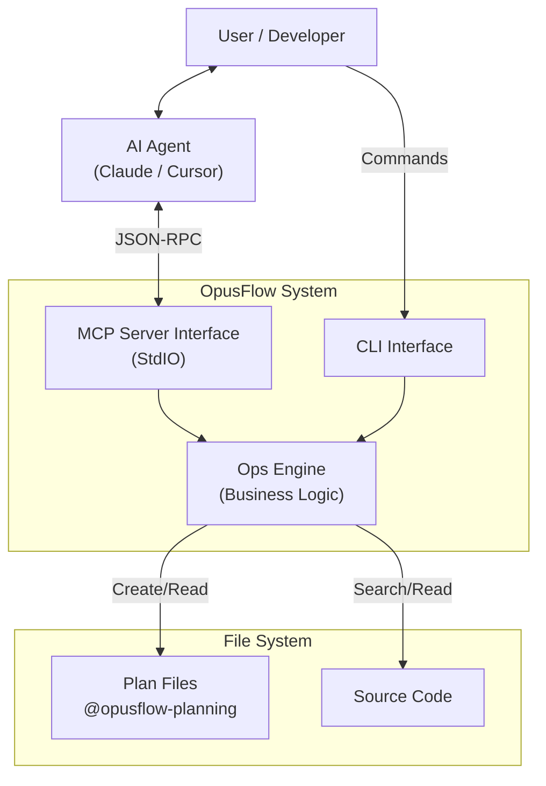
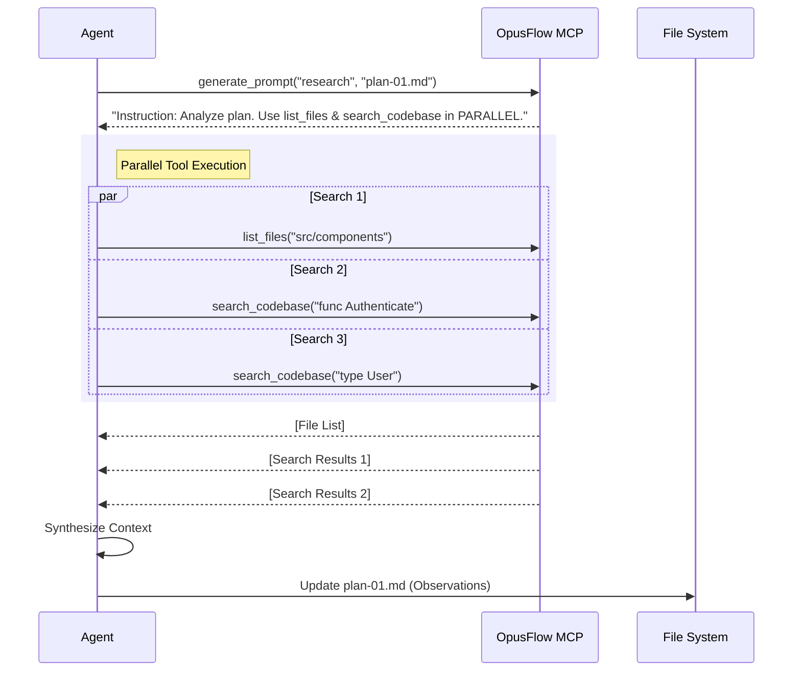

# OpusFlow Architecture

## Overview

OpusFlow is designed as a **bridge** between Human Intent, AI Agents (like Claude, Cursor), and the Local File System. It operates on the philosophy of **"Plan-First Development"**, ensuring that AI agents treat coding tasks as structured workflows rather than one-off chat interactions.

It functions in two modes:
1.  **CLI Tool**: For humans to bootstrap plans and verify work.
2.  **MCP Server**: For AI Agents to autonomously interact with the project structure.

## System Design

## Core Components

### 1. The MCP Server (`cmd/mcp.go`)
This component implements the **Model Context Protocol**, exposing internal tools to the AI Agent. It handles the JSON-RPC communication over StdIO.

**Exposed Tools:**
*   `create_plan`: Bootstraps a structured markdown plan.
*   `generate_prompt`: Serves dynamic, context-aware instructions to the Agent.
*   `list_files` & `search_codebase`: Read-only tools for context gathering.

### 2. The Ops Engine (`internal/ops`)
The "Brain" of the application. It contains reusable logic shared between the CLI and MCP modes.
*   **PlanOps**: Validates titles, manages indices, and applies templates.
*   **ResearchOps**: Implements fast, recursive file walking and content searching (a mini-grep).
*   **PromptOps**: Logic to generate phase-specific system prompts.

### 3. The Planning System
OpusFlow does not use a database. It uses the file system as the source of truth.
*   **Plans**: stored in `opusflow-planning/plans/` (or configured dir).
*   **Format**: Strict Markdown Templates.

### 4. Project Root Discovery
To support monorepos and flexible setups, OpusFlow dynamically locates the project root by walking up the directory tree looking for:
1.  `opusflow-planning/` directory
2.  `.agent/` directory
3.  `.git/` directory

**Auto-Initialization**: If no markers are found, OpusFlow automatically initializes the project at the current working directory by creating:
- `.agent/workflows/` - For workflow definitions
- `opusflow-planning/plans/` - For implementation plans
- `opusflow-planning/phases/` - For multi-phase breakdowns
- `opusflow-planning/verifications/` - For verification reports

This allows OpusFlow to work seamlessly in fresh projects without manual setup, making it ideal for use as an MCP server in any directory.

## Workflows

### The "Deep Dive" Research Flow

This flow demonstrates the **Parallel Tool Calling** capability of the architecture.

1.  **Instruction**: The Agent requests instructions for the "research" phase.
2.  **Parallel Execution**: The Agent receives a prompt explicitly encouraging parallel usage. It fires multiple tool calls simultaneously.
3.  **Aggregation**: The MCP server processes these concurrently (or sequentially if bound by IO, but effectively concurrent for the Agent) and returns rich context.
4.  **Synthesis**: The Agent uses this "Deep Dive" data to fill out the *Observations* and *Missing Components* sections of the plan before writing any code.

## Future Extensibility

The architecture is designed to be easily extensible:
*   **New Tools**: Add a new function in `ops/` and register it in `cmd/mcp.go`.
*   **New Templates**: Add new markdown structures in `internal/templates/`.
*   **Remote State**: The `manager` package can be upgraded to sync plans with a remote API (e.g., Jira/Linear) without changing the Agent interaction layer.
