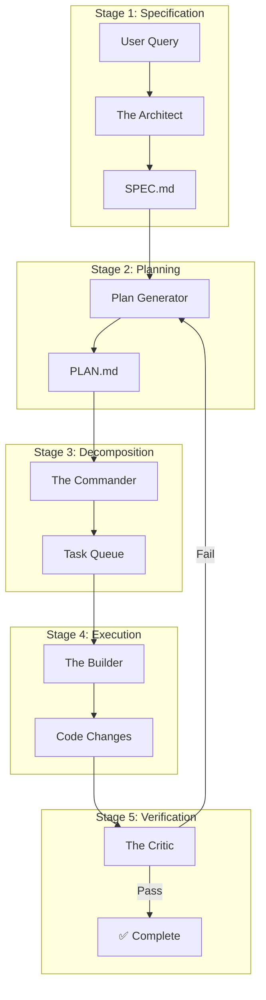
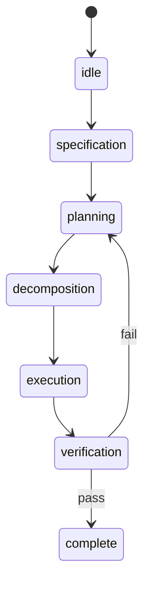

# OpusFlow Architecture

## Overview

OpusFlow is an **Orchestrator of Orchestrators** - a Spec-Driven Development (SDD) engine that structures AI-assisted coding into distinct phases with specialized agents.

It functions in two modes:
1. **CLI Tool**: For humans to manage workflows and verify work.
2. **MCP Server**: For AI Agents to autonomously interact with the project.

## SDD Workflow



## Core Components

### 1. The Librarian (`ops/codebase_map.go`)

Indexes the codebase and provides compressed context.

- **AST Parsing**: Uses `go/ast` for Go, regex for TS/JS/Python
- **Symbol Extraction**: Functions, types, classes, interfaces
- **Output**: ~2k tokens vs 200k for full source

**MCP Tool**: `get_codebase_map`

### 2. The Architect (`ops/spec.go`)

Generates high-level specifications (WHAT, not HOW).

- **SPEC.md Template**: Goals, requirements, edge cases
- **No Code Allowed**: Only requirements and constraints
- **Codebase Context**: Auto-includes symbol summary

**MCP Tool**: `create_spec`

### 3. The Commander (`ops/tasks.go`)

Breaks plans into atomic, non-overlapping tasks.

- **Plan Parsing**: Extracts steps from markdown
- **Dependency Tracking**: Sequential task ordering
- **Queue Management**: Status tracking per task

**MCP Tools**: `decompose_plan`, `get_next_task`, `complete_task`

### 4. The Builder (`ops/builder.go`)

Executes tasks using external coding agents.

- **Agent Support**: Aider, Claude Code, Cursor
- **Prompt Generation**: Context-aware task prompts
- **Diff Capture**: Tracks changes for verification

### 5. The Critic (`ops/critic.go`)

Verifies implementation against plans/specs.

- **Automated Checks**: Build, tests, file existence
- **Git Diff Analysis**: Summarizes changes
- **LLM Verification**: Generates structured review prompts

### 6. The Orchestrator (`orchestrator/orchestrator.go`)

Manages workflow state machine with phase transitions.



## MCP Server Tools (v1.2.0)

| Tool | Description |
|------|-------------|
| `create_plan` | Create implementation plan |
| `create_spec` | Create specification |
| `get_codebase_map` | Compressed project structure |
| `decompose_plan` | Break plan into tasks |
| `get_next_task` | Get pending task |
| `complete_task` | Mark task done |
| `generate_prompt` | Generate agent prompts |
| `list_files` | List project files |
| `read_file` | Read file content |
| `write_file` | Write file content |
| `run_command` | Execute shell commands |
| `search_codebase` | Search for patterns |

## File System Structure

```
opusflow-planning/
├── specs/              # Feature specifications (SPEC.md)
├── plans/              # Implementation plans (PLAN.md)
├── phases/             # Multi-phase breakdowns
└── verifications/      # Verification reports

.opusflow/
├── workflow-state.json # Current workflow state
└── tasks-*.json        # Task queues
```

## Extensibility

- **New Agents**: Add integration in `ops/builder.go`
- **New Tools**: Add function in `ops/` and register in `cmd/mcp.go`
- **Custom Templates**: Extend templates in `internal/templates/`
