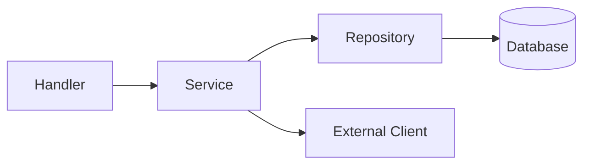

# Plan Workflow

Direct, step-by-step implementation for single-PR tasks. Perfect for straightforward development tasks where you want a direct, step‑by‑step guide from idea to implementation.

## When to Use

- Single feature or bug fix
- Changes scoped to one service or component
- Work that fits in one pull request

---

## The 5-Step Process

### Step 1: User Query

Describe your task with relevant context:

| Context Type | Examples |
|--------------|----------|
| **Files** | Source files, config files, documentation, test files |
| **Folders** | Component directories, feature folders, asset directories |
| **Images** | UI mockups, error screenshots |
| **Git Diff** | Uncommitted changes, diff against main/branch/commit |

**Example Query:**
```
Add a new endpoint POST /api/v1/projects that creates a project
within an organization. Include validation and proper error handling.

Context:
- @services/platform-service/internal/handler/
- @services/platform-service/internal/service/
```

### Step 2: Detailed File-Level Plan

The Agent generates a comprehensive plan with:

- **File analysis & structure**: What exists, what needs to change
- **Symbol references**: Functions, types, interfaces to use
- **Implementation steps**: Exact changes for each file
- **Testing strategy**: How to verify correctness

**Plan Output Format:**
You MUST save the output to a new file: `/home/tuanbt/ErgonML-PaaS/opusflow-planning/plans/plan-[phase#]-[name].md`.

```markdown
Follow the below plan verbatim. Trust the files and references.
Do not re-verify what's written in the plan.

## Pre-requisites

- **Dependencies**: List any packages, services, or migrations required
- **Prior Context**: Link to related phases, prior plans, or documentation
- **Environment**: Any configuration or setup needed

## Observations

- **Current State**:
  - Existing files and their roles
  - Relevant database schemas or APIs
  - Patterns already in use (e.g., repository pattern, DI)
  
- **Missing Components**:
  - What needs to be created
  - What needs modification

- **Architecture**:
  - Key design patterns to follow
  - Integration points
  - Data flow overview

## Approach

- **Strategy**: High-level implementation approach
- **Key Decisions**: Architectural choices and rationale
- **Risks/Considerations**: Edge cases, performance, security

## Architecture Diagram (Optional)



## Implementation Steps

### Step 1: [Component] ([Language])

**File**: `/absolute/path/to/file.ext`
**Action**: Create | Update

**Purpose**: Brief description of what this step accomplishes

**Changes:**
- `FunctionName(args) -> return_type`: Description of function
- `StructName`: Fields and purpose

**Implementation Details:**
1. Specific logic to implement
2. Error handling approach
3. Edge cases to handle
4. Validation requirements

**Symbol References:**
- Uses: `ExistingType` from `pkg/types` (line ~XX)
- Implements: `InterfaceName` from `pkg/interfaces`
- Depends on: `OtherFunction()` from `pkg/other`

**Error Handling:**
- Handle: [specific error case] with [approach]
- Return: [error type] when [condition]

**Tests:**
- Unit test: `TestFunctionName` covering [scenarios]

---

### Step 2: [Component] ([Language])

**File**: `/absolute/path/to/file.ext`
**Action**: Create | Update

**Purpose**: Brief description

**Changes:**
- `FunctionName(args) -> return_type`: Description

**Implementation Details:**
1. Logic details
2. Validation steps
3. Database operations

**Symbol References:**
- Uses: `Type` from `package`
- Calls: `Dependency.Method()`

**Integration:**
- Connects to: [service/component]
- Called by: [handler/service]

---

### Step N: Integration & Wiring

**File**: `/absolute/path/to/main.go` or `router.go`
**Action**: Update

**Purpose**: Wire all components together

**Changes:**
- Initialize new repositories/services
- Register handlers/routes
- Configure dependency injection

**Verification:**
- Build: `go build ./...`
- Lint: `golangci-lint run`

---

### Step N+1: Testing

**File**: `/absolute/path/to/file_test.go`
**Action**: Create | Update

**Purpose**: Validate implementation

**Test Cases:**
| Test Name | Scenario | Expected Outcome |
|-----------|----------|------------------|
| `TestCreateSuccess` | Valid input | Returns created entity |
| `TestCreateInvalid` | Invalid input | Returns 400 error |
| `TestCreateDuplicate` | Duplicate key | Returns 409 conflict |

**Verification:**
- Run: `go test ./... -v`
- Coverage: Minimum 80% for new code

---

## Success Criteria

| Criterion | How to Verify |
|-----------|---------------|
| Build passes | `go build ./...` exits 0 |
| Tests pass | `go test ./...` exits 0 |
| Lint passes | `golangci-lint run` exits 0 |
| API works | `curl` test returns expected response |
| Integration | End-to-end flow completes successfully |

---

## Execution Checklist

- [ ] All steps implemented in order
- [ ] All tests passing
- [ ] No lint errors
- [ ] Documentation updated (if applicable)
- [ ] Ready for verification
```

### Step 3: Execute

Execute the plan with your coding agent:

- **Agent**: Apply the implementation steps sequentially
- **Order**: Follow step numbers exactly
- **Verification**: Run verification commands after each major step

**Execution Command:**
```
Follow the plan in [path/to/plan.md] verbatim.
Execute each step in order. After completion, run the verification commands.
```

### Step 4: Verification

After implementation, verify against the plan:

- Compares agent's implementation against original plan
- Categorizes comments by severity: **Critical, Major, Minor, Outdated**
- Ensures all success criteria are met

*Use the [Verification Workflow](verification.md) for this step.*

**Verification Prompt:**
```
Verify the implementation against the plan in [path/to/plan.md].
Check each step was implemented correctly.
Report any deviations using Critical/Major/Minor/Outdated categories.
```

### Step 5: Complete

Once verified, the task is done. Commit and push your changes.

**Completion Checklist:**
- [ ] All verification comments addressed
- [ ] Final build passes
- [ ] Commit with descriptive message referencing the plan
- [ ] Update phase status (if part of a larger project)

---

## Quality Standards

| Rule | Description |
|------|-------------|
| **No Placeholders** | Describe actual logic, not "TODO" or "implement here" |
| **Absolute Paths** | Use full paths from project root |
| **Consistent Names** | Variable/function names must match across files |
| **Complete Signatures** | Include all parameters and return types |
| **Symbol References** | Reference existing code symbols explicitly with line numbers |
| **Error Handling** | Explicit error cases and handling for each step |
| **Test Coverage** | Every new function should have corresponding test cases |
| **Integration Points** | Document how components connect |

---

## Plan Quality Checklist

Before executing, ensure the plan:

- [ ] Has all **Pre-requisites** documented
- [ ] Contains complete **Observations** (Current State, Missing, Architecture)
- [ ] Includes clear **Approach** with rationale
- [ ] Every step has **File**, **Action**, **Purpose**
- [ ] **Symbol References** link to existing code
- [ ] **Error Handling** is specified
- [ ] **Testing** steps are included
- [ ] **Success Criteria** are measurable
- [ ] Uses **absolute paths** throughout
- [ ] No TODOs or placeholders remain
